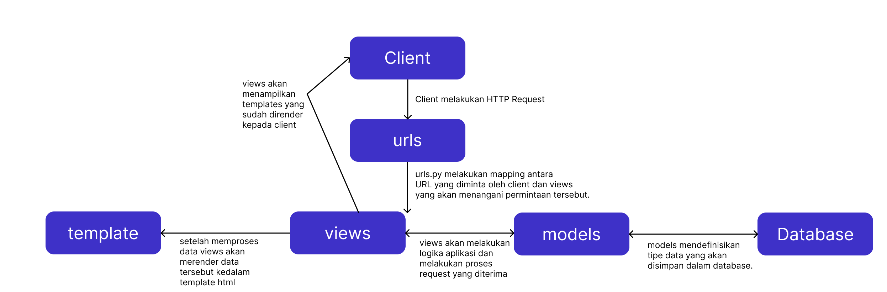

# Link Domain :
- [Aplikasi Adaptable](https://tedskinventory.adaptable.app)
- [Domain PBP CSUI](theodoore-kasyfillah-tedskinventory.pbp.cs.ui.ac.id)

# TUGAS 2
## Langkah-Langkah untuk Mengerjakan Tugas 2
1. Buat Repo di local sama github dengan nama proyek (nama project saya = tedskinventory)
2. Buka CMD dari repo localnya
3. Inisialisasi git dulu di reponya trus verifikasi akun github
4. Inisialiasi Virtual Environment yang akan digunakan
5. Inisialisasi django dengan install requirements yang diperlukan seperti django untuk membuat aplikasinya dan requirements lain seperti Psycopg2-binary yang berguna nantinya untuk database postgreSQL yang kita pilih saat deployment nanti
6. Kemudian mulai proyeknya dengan memberi command (django-admin startproject tedskinventory) biar nanti akan dibuat file projek didalam repo kita
7. Kemudian karena django udah diinisialisasi kita bisa mulai ngebikin aplikasinya
8. Untuk inisialisai si aplikasinya pertama kita start projectnya dlu dengan command (python manage.py startapp main) untuk membuat sebuah project files bernama main
9. Kemudian kita isi si aplikasi main tersebut dengan folder templates yang nanti isinya adalah file html yang bisa kita kostumisasi sebagai template aplikasi kita dengan style sesuka kita
10. Konfigurasi urls.py pada folder proyek untuk melakukan routing dengan memberikan command path('main/', include('main.urls')) dengan tujuan memastikan bahwa ketika kita mengakses URL ke main, fungsi yang sesuai akan dijalankan.
11. Kemudian di main kita bakal konfigurasi data yang diperlukan di aplikasi kita nanti
12. Isi models.py dengan tipe data yang kita perlukan sebagai contoh saya menggunakan 5 atribut, yaitu: 
    name = models.CharField(max_length=255) (untuk mengisi nama dari item yang saya masukkan kedalam aplikasi saya nantinya, menggunakan tipe data charfield namun saya beri batasan untuk banyak karakternya sebanyak 255 karakter, alasan saya tidak menggunakan textfield adalah karena tidak perlu menggunakan banyak character)
    image = models.ImageField(upload_to='products/', null=True, blank=True)(untuk mengisi gambar dari item, menggunakan tipe data imagefields dan memprosesnya menggunakan sebuah library dari python yang bernama pillow)
    price = models.CharField(max_length=255)(untuk mengisi harga dari item yang saya masukkan kedalam aplikasi saya nantinya, menggunakan tipe data charfield namun saya beri batasan untuk banyak karakternya sebanyak 255 karakter, alasan saya tidak menggunakan textfield adalah karena tidak perlu menggunakan banyak character dan saya tidak menggunakan integerfield karena ada string Rp pada bagian tersebut)
    description = models.TextField()(untuk mengisi deskripsi dari item, menggunakan tipe data TextFields agar bisa memuat string lebih banyak)
    amount = models.IntegerField()(untuk mengisi berapa jumlah stok yang tersedia dari item, menggunakan tipe data IntegerFields)
13. Isi context pada views.py dengan isian sesuai dengan atribut yang diperlukan dari template untuk dirender ke file main.html dengan fungsi show_main.
14. setelah mengisi template,models,dan views. kita lakukan routing pada folder main untuk memastikan bahwa permintaan ke URL main akan ditangani oleh fungsi show_main.
15. Setelah itu kita akan melakukan testing local
16. jika testing berhasil kia akan push projek kita ke repo github yang sudah kita hubungkan sebelumnya
17. Setelah berhasil dipush ke github kita akan melakukan deployment ke adaptable dengan memilih repo yang kita gunakan untuk proyek kali ini dengan deployment, database, dan server http wsgi yang sudah kita install pada saat inisialiasi yang terletak pada requirements.txt
18. Setelah deployment berjalan dengan lancar kita dapat mengecek domain aplikasi main yang sudah kita deploy

## Bagan Penjelasan
Berikut adalah bagan penjelasan yang berisikan request client dan kaitan antara urls.py, views.py, models.py, dan berkas html.

## Mengapa Menggunakan Virtual Environment?
Mengapa kita menggunakan virtual environment? Apakah kita tetap dapat membuat aplikasi web berbasis Django tanpa menggunakan virtual environment?
=> Kita menggunakan virtual environment dalam pengembangan Django supaya workspace kita lebih terorganisir untuk masing masing proyek. Virtual Environment berperan juga supaya tidak terjadi masalah seperti tabrakan versi dan juga berguna untuk menjaga dependensi jadi lebih teratur . Sebenarnya kita bisa saja kita membuat Aplikasi tanpa virtual environment, tetapi disarankan untuk menggunakannya agar proyek-proyek kita lebih terorganisir.

## Penjelasan Mengenai MVC, MVT, dan MVVM
Berikut adalah penjelasan tentang MVC, MVT, dan MVVM:
MVC (Model-View-Controller): MVC adalah konsep arsitektur aplikasi yang umum digunakan untuk mengimplementasikan UI, data, dan controller. konsep ini menekankan pemisahan antara logika bisnis aplikasi dan tampilan. Pemisahan ini memberikan pembagian kerja yang lebih baik dan pemeliharaan yang lebih baik.

MVT (Model View Template): MVT adalah konsep arsitektur  aplikasi yang terdiri dari tiga komponen: Model, View, dan Template. Model menangani informasi , View menampilkan data, dan Template mendefinisikan tata letak halaman web. Meskipun mirip dengan MVC, MVT memiliki perbedaan dalam cara kerjanya.

MVVM (Model-View-ViewModel): MVVM adalah konsep arsitektur  dalam aplikasi komputer yang memfasilitasi pemisahan pengembangan GUI dari pengembangan logika bisnis atau logika back-end (model) sehingga tampilan tidak bergantung pada platform model tertentu. ViewModel bertindak sebagai konverter nilai, yang bertanggung jawab untuk mengonversi objek data dari model sedemikian rupa sehingga dapat dengan mudah dikelola dan disajikan.

Perbedaan utama antara ketiganya adalah komponen yang digunakan dalam arsitektur tersebut. MVC memisahkan aplikasi menjadi Model, View, dan Controller, dengan komunikasi antara mereka melalui pengamatan dan pengontrolan. Di sisi lain, MVT, yang umumnya digunakan dalam kerangka kerja web Django, memiliki komponen Template tambahan yang mengatur tampilan halaman web. Sementara itu, MVVM memisahkan aplikasi menjadi Model, View, dan ViewModel, dengan ViewModel berperan sebagai perantara antara Model dan View, memungkinkan pemisahan yang lebih jelas antara tampilan dan logika aplikasi. Setiap konsep ini memiliki karakteristiknya sendiri dan digunakan sesuai kebutuhan proyek dan teknologi yang digunakan.

Referensi:
https://code.visualstudio.com/docs/python/tutorial-django
https://stackoverflow.com/questions/62181396/django-does-the-virtual-environment-have-to-be-on-every-time-i-develop-my-djang
https://developer.mozilla.org/en-US/docs/Glossary/MVC
https://www.javatpoint.com/django-mvt
https://learn.microsoft.com/en-us/dotnet/architecture/maui/mvvm

# TUGAS 3
